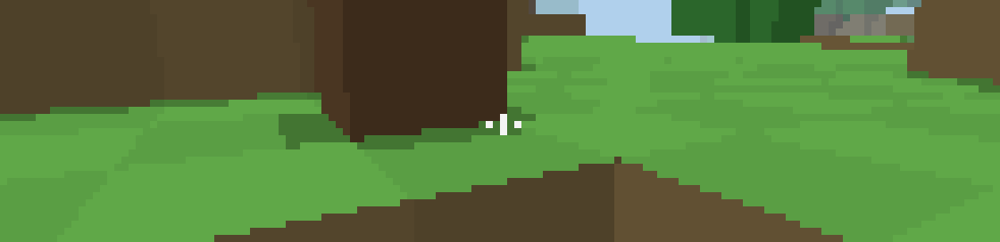
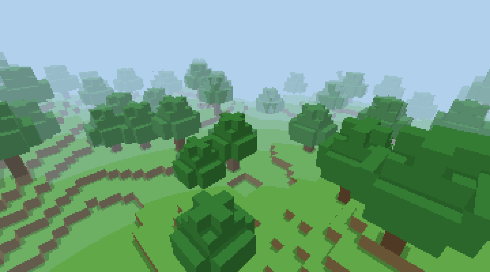

# claude-mine

Воксельная песочница в духе Minecraft прямо над строкой ввода Claude Code: бесконечный мир с холмами
и деревьями, добыча и установка блоков, инвентарь, крафт инструментов. Играть можно, пока Claude
работает; когда он заканчивает ответ, в строке статуса появляется «● Claude закончил» (игра при этом
не останавливается). Токены не расходуются: команда и игра отвечают сами, модель не вызывается.

Это мод Claude Code на **function hooks** (ранний доступ): TypeScript, который выполняется внутри
процесса Claude Code. API может меняться между релизами.



Кадр выше — то, что рисуется в полосе над строкой ввода (предпросмотр `npm run preview` в полном
цвете; в терминале на 256 цветов оттенки грубее). Ниже — тот же мир тем же рендером, но в большом
разрешении, которого в терминале нет: он показывает, как устроен мир, а не как выглядит игра.



## Что нужно

- Claude Code 2.1.269 или новее и переменная `CLAUDE_CODE_ENABLE_FUNCTION_HOOKS=1`.
- Запуск в терминале (`claude`). В панели VSCode, десктопном и мобильном приложении игра не рисуется.
- **Полноэкранный режим: `/tui fullscreen`.** Клавиатуру игре даёт клик по полю, а клики Claude Code
  видит только в этом режиме. В обычном режиме игра откроется и сама об этом скажет.
- **Терминал с 24-битным цветом** (iTerm2, терминал VSCode, Ghostty, kitty, WezTerm). Там картинка
  выглядит как задумано. Внутри tmux и в терминалах без truecolor (стандартный Terminal.app) Claude
  Code сам огрубляет цвета до палитры из 256: играть можно, но оттенки слипаются, земля розовеет.
- **Высокое окно.** Полосе над строкой ввода движок отдаёт примерно половину высоты терминала минус
  6 строк; игра берёт её всю (две строки — хотбар и статус):

  | Высота терминала | Вид |
  |---|---|
  | 50 строк | 17 строк вида (140×34 пикселя при ширине 140) |
  | 30 строк | 7 строк вида — тесно, но играть можно |
  | меньше ~28 | игра не открывается и пишет, что окно нужно растянуть |

## Установка

1. **Включить function hooks.** В `~/.claude/settings.json` добавить (или слить с существующим `env`):

   ```json
   { "env": { "CLAUDE_CODE_ENABLE_FUNCTION_HOOKS": "1" } }
   ```

   Это включает модули хуков у всех установленных плагинов, а не только у этого.

2. **Поставить плагин с GitHub** — репозиторий сам себе marketplace (каталог плагинов из одного плагина):

   ```sh
   claude plugin marketplace add swan4er/claude-mine
   claude plugin install claude-mine@claude-mine
   ```

3. **Проверить.** `claude plugin list` показывает `claude-mine@claude-mine … enabled`. Перезапустить
   `claude` в терминале, выполнить `/tui fullscreen`, затем `/mine`.

Из своей копии (для правок): `git clone https://github.com/swan4er/claude-mine`, дальше те же две команды, но
вместо `swan4er/claude-mine` — путь к папке. Без установки, на один запуск:
`CLAUDE_CODE_ENABLE_FUNCTION_HOOKS=1 claude --plugin-dir /путь/к/claude-mine`.

Обновление: установленный плагин — копия в `~/.claude/plugins/cache/`; менеджер сравнивает номер
версии. Поднять `version` в `.claude-plugin/plugin.json` → `claude plugin marketplace update claude-mine`
→ `claude plugin update claude-mine@claude-mine` → перезапустить `claude`. Мир у установленного
плагина и у запущенного через `--plugin-dir` хранится раздельно.

Удаление: `claude plugin uninstall claude-mine@claude-mine`, затем `claude plugin marketplace remove claude-mine`.

## Как играть

`/mine` открывает и закрывает игру, `/mine new [зерно]` начинает новый мир (старый стирается).

Кликните по полю — игра получает клавиатуру. **Esc** возвращает клавиатуру строке ввода.

| Действие | Клавиши |
|---|---|
| Идти | `W` `A` `S` `D` — одно нажатие — шаг; удержание — ходьба |
| Смотреть | `←` `→` поворот, `↑` `↓` наклон; мышь над полем поворачивает взгляд на своё смещение, как в шутерах: куда ведёте, туда и смотрит. У левого и правого края поля взгляд доворачивается сам (до секунды после последнего движения), у верхней и нижней строки — наклоняется. `[` `]` — чувствительность (×0,5…×2), `M` — выключить мышь |
| Прыжок | пробел; на уступ в один блок игрок поднимается сам |
| Ломать | `Q` или левый клик — один раз; дальше блок ломается сам, пока на него смотришь |
| Ставить | `E` или правый клик — блок из выбранного слота |
| Слот | `1`–`9` |
| Инвентарь и крафт | `I` или Tab; `↑` `↓` рецепт, Enter скрафтить |
| Обзор | `V` — насколько картинка сжата по вертикали: 1,5 → 2 → 1 |

Клавиши работают и в русской раскладке (`ц ф ы в`, `й`, `у`, `ш`, `м`, `ь`).

Путь развития: рукой ломаются трава, земля, листва и брёвна → из бревна доски, из досок палки →
деревянная кирка → камень (без кирки он крошится в ничто) → каменные инструменты. Кирка ускоряет
камень, топор — дерево, лопата — землю и песок. Меч крафтится, но врагов пока нет.

Полоса низкая и широкая, поэтому вид — «смотровая щель»: по горизонтали ~95°, по вертикали сколько
поместится. Чтобы увидеть землю под ногами или крону над головой, наклоняйте взгляд. Целиться
«строго под себя» лучше стоя в центре клетки: у её края луч уходит в соседний блок.

Мир сохраняется сам раз в 10 секунд после изменений: зерно, место игрока, инвентарь и все сломанные
и поставленные блоки. Предел — около 15 000 изменённых блоков (сохранение уходит одним сообщением
до 95 000 символов); после него игра продолжается, но новые изменения не сохраняются.

## Устройство

Вся игра — чистые функции в `hooks/game/`, без зависимостей от Claude Code:

- `noise.ts` — хеш и шум от координат и зерна: мир — функция, а не данные.
- `blocks.ts` — реестр блоков и предметов **данными**: цвета граней, прочность, нужный инструмент, дроп.
- `world.ts` — бесконечный мир чанками 16×16×64: чанк строится при первом обращении; правки игрока
  хранятся отдельно и накладываются поверх, поэтому в сохранение идут только они. Кроны на границах
  чанков не зависят от порядка генерации.
- `raycast.ts` — луч через воксельную сетку (3D-DDA); один и тот же луч рисует пиксель и выбирает
  блок под прицелом. `cast()` пишет в общий объект (его зовут тысячи раз за кадр) — хранить можно
  только результат `pick()`.
- `player.ts` — гравитация, столкновения, «запас пути» вместо удержания клавиш, авто-подъём на уступ.
- `mining.ts`, `inventory.ts`, `craft.ts` — добыча, стопки, рецепты (рецепты — данные).
- `render.ts` — кадр: луч на пиксель → цвет; затенение граней, туман ступенями, тень у подножия уступов.
- `runs.ts` — кадр → отрезки полублоков `▀` с **жёстким бюджетом**: движок выгружает игру целиком,
  если дерево кадра длиннее 100 000 символов, поэтому стоимость считается, а лишнее огрубляется.
- `game.ts` — состояние, действия, шаг игры, перевод реального времени в шаги логики, сохранение.

`hooks/view.tsx` — поверхность (`Client`): клавиши, мышь, время, вывод. `hooks/register.tsx` — хуки:
команда, сохранение в `$.store`, сигнал «Claude закончил».

Измеренные факты о среде, на которых стоят эти решения, — в `docs/probes.md`; общая инструкция по
function hooks для агентов — в `docs/agent-notes.md`.

## Разработка

```sh
npm test             # логика, мир, рендер, упаковка кадра: node --test, без зависимостей (node 24+)
npm run test:hooks   # хуки и поверхность в окружении движка: claude plugin test
npm run typecheck    # tsc; типы API кладёт /plugin-types в .claude/types
npm run preview      # кадры мира в PNG (preview/), без Claude Code
node tools/ansi2png.ts снимок.ansi кадр.png   # снимок терминала (tmux capture-pane -e -p) → PNG
```

В тестах есть бот-выживальщик: только действиями игрока он находит дерево, добывает брёвна, крафтит
доски → палки → деревянную кирку, докапывается до камня и крафтит каменную кирку — на пяти зёрнах.
Это доказывает, что цикл игры проходим; удобство управления бот не проверяет.

## Чего пока нет

Воды, руд, существ, дня и ночи, звука, текстур (блоки однотонные). Бюджет кадра использован меньше
чем наполовину (220–400 отрезков из ~1000), так что запас на детали есть.
